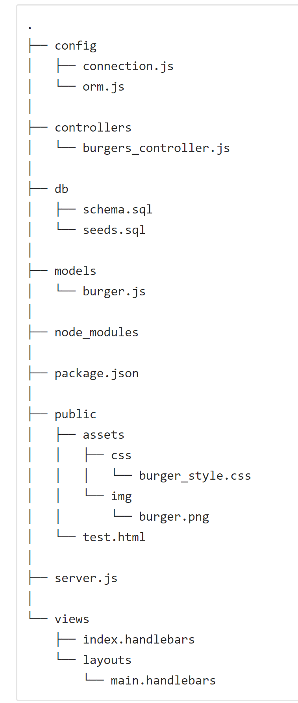

 # :hamburger: BurgerTime :fries:

A simple Node Express application that utilizes Handlebars to render the graphical user interface.  The user can choose from the burgers available to be eaten (stored in the database), or they can enter a selection via the text box and add it to the list.  The "devour" button will change the burger's status to "eaten" and it will move to the right side of the screen.  

This project utilizes the Model View Controller paradigm; the controller uses Node to route the data and MySQL to perform table operations, while Handlebarsjs generates the html for the page. A high level diagram is included below to illustrate the file structure for the project.

# Technologies utilized:
- Node.js
- MySQL
- Handlebars
- Heroku

# Node packages included:
- Express
- Handlebars
- Body-parser
- mySQL
- Heroku

# Deployment:
- Available on github at https://github.com/tsstace/BurgerTime
- Deployed to Heroku as well at https://git.heroku.com/thawing-stream-55549.git

# Directory file structure:

